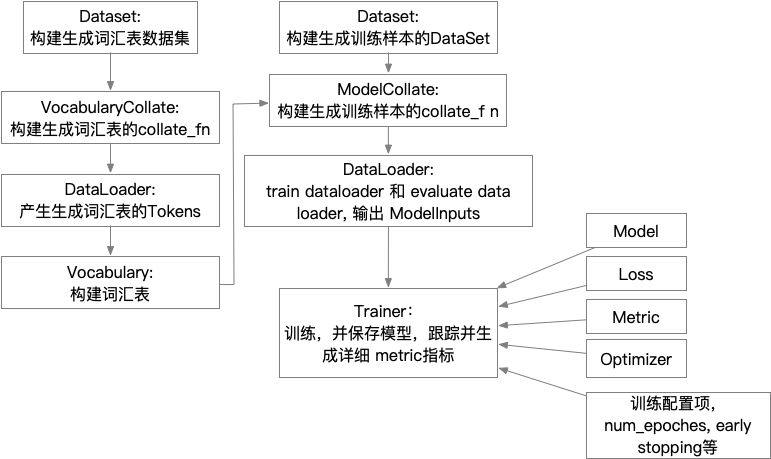

# easytext
让自然语言模型训练更容易

## 安装

`pip install easytext-nlp`

注意: pip repository 中存在一个 easytext，不是本项目，不要安装错了。
也就是 `pip install easytext` 并非安装的是本项目。

## 构建训练
训练的具体构建流程如下:

# docs: 文档

`mkdocs serve` 启动文档服务。

其中:

* uml: 文件夹下是 uml 设计文档，使用 "Visual Paradigm" 工具打开
* 开发计划: 列出了已经开发出的功能和特性
* 相关模型说明以及论文文档

# ner: 命名实体识别

命名实体识别相关模型，包括 baseline 模型:

1. bilstm + softmax
2. bilstm + crf

# event: 事件识别

事件识别以及事件要素识别模型。

## event_detection_without_tirgger

ACL 2019 论文，忽略触发词的事件类型检测。
* [相关论文](https://www.aclweb.org/anthology/N19-1080/)
* [我的简书](https://www.jianshu.com/p/01deb5b22240)

更加详细说明，请参考: `docs/docs/event/event_detection_without_trigger.md`

# acsa

属性级情感分析，baseline 模型:

## ATAELstm

2016 emnlp 基于 Attention Lstm 的 属性级情感分析模型.

* 相关论文参考: `docs/docs/acsa/相关文章及论文/2016-emnlp-Attention-based LSTM for Aspect-level Sentiment Classification.pdf`
