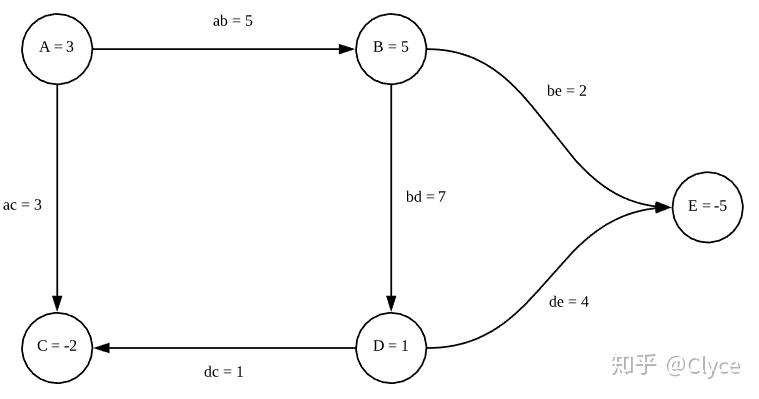
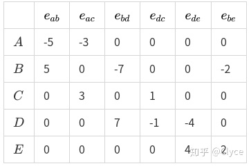
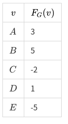
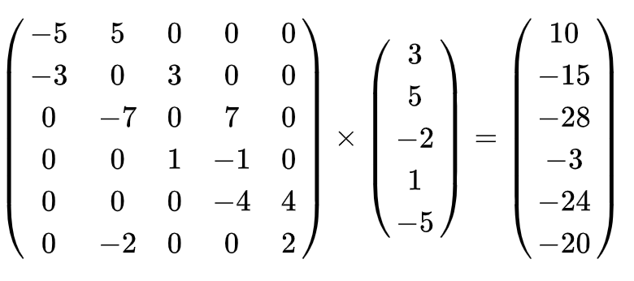
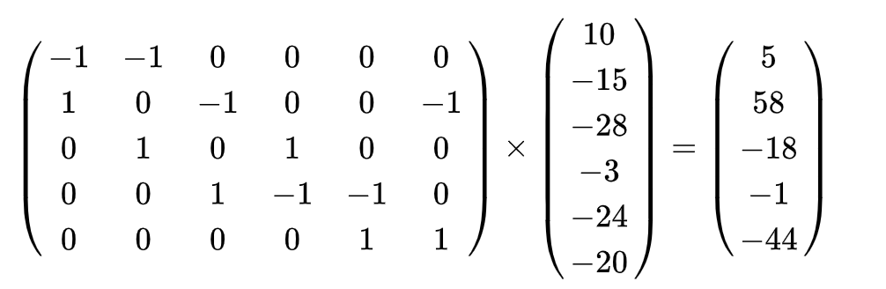
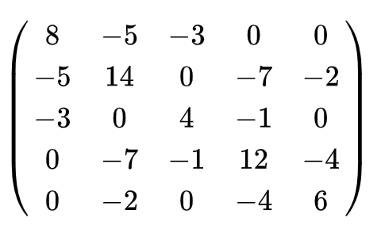

# 图卷积

## 什么是图

$/$

## 图的特点

## 拉普拉斯算子
函数 $f$ 的拉普拉斯算子 $\bigtriangledown ^ 2f$ 也可以写成 $\bigtriangledown \cdot \bigtriangledown f$, 定义为 $f$ 梯度的散度。

## 图的函数

图中包含的所有点 $V$ 集合，所有边是 $E$ 集合,

定义一个图函数: $F_{G}(V) = R$ 



## 图函数的梯度

$f(x)$ 的梯度，

$$
\frac{\partial{f}} {\partial{x}} = \frac{f(x + \Delta x) - f(x)} {\Delta x}
$$

图上的梯度定义如下:

$$
\frac{F_{G}(v_0) - F_{G}(v_1)}{d_{01}} = （F_{G}(v_0) - F_{G}(v_1)）e_{01}
$$

其中, $d_{01}$ 表示 $v_0$ 到 $v_1$ 的距离, 没有边表示距离无穷大, $e$ 表示的权重，也就是目前边上的值。

于是，我们有一个图矩阵, $K_{G}$:



其中，边上的权重是 $W$, 如果边是从该点发出，则是 $-W$, 指向改点，则是 $W$

同时我们还有图函数的向量 $f_{G}$:



将 $K_{G}^{T} \times f_{G}$:




该乘积的结果就是图 G 在 $F_{G}$ 上的梯度 $\bigtriangledown_{G}F_{G}$。
最终的梯度是与边对应的。

所以有图G的梯度, $\bigtriangledown_{G}F_{G} = K_{G}^{T} \times f_{G}$

### 拉普拉斯

拉普拉斯算子，是梯度的散度，也就是: 从该点射出去的梯度减去射入的梯度。

只需要在原来的梯度向量上乘以矩阵即可。这个举着可以这样定义:
```
每一行代表一个点，每一列代表边, 如果该边有发出的为+1， 射入的 -1.
```



这样我们有了:

$$
\bigtriangledown^2_{G}F_{G} 
= K^{'}_{G} \times \bigtriangledown_{G}F_{G} 
=  K^{'}_{G} \times (K^{T}_{G} \times f_{G}) 
= (K^{'}_{G} \times K^{T}_{G}) f_{G}
$$

于是:

$K^{'}_{G} \times K^{T}_{G}$ ，就是拉普拉斯矩阵，就被称作拉普拉斯算子。

如果我们将任意的一条边方向翻转，等价于 $K_{G}$ 列乘以 $-1$, 也就是 $K_^{T}{G}$ 行乘以 $-1$, 这个值是不变的。这说明拉普拉斯矩阵与图中边的方向无关，所以拉普拉斯矩阵一般来表示无向图。

$K^{'}_{G} \times K^{T}_{G}$ 的最终结果:



通过这个矩阵，我们看到:
对角线就是每个点的度, 其余的元素都是负的邻接矩阵。
所以有:

$$
L = D - W
$$


## 傅里叶变换
参考 "傅里叶变换" 章节

## 卷积

## 图傅里叶变换

将图从 "空域" 转换到 "频域"。对于拉普拉斯矩阵 $L$ 由于是实对称矩阵，所以可以正交对角化。

$$
L = V \Lambda V^{T} = 
\begin{bmatrix}
\vdots & \vdots & \cdots & \vdots\\ 
v_1    & v_2    & \cdots & v_n\\
\vdots & \vdots & \cdots &\vdots \\
\end{bmatrix}

\begin{bmatrix}
\lambda_1 \\ 
& \lambda_2 \\
& & \ddots \\
& & & \lambda_n \\
\end{bmatrix}

\begin{bmatrix}
\cdots & v_1 & \cdots\\ 
\cdots & v_2 & \cdots\\
\cdots & \vdots & \cdots \\
\cdots & v_n & \cdots \\
\end{bmatrix}
$$

其中: $V$ 是正交矩阵, $VV^{T} = I, V^{-1} = V^{T}$, $V = [v_1, v_2, ..., v_n]$

所以, $V$ 的每一个向量都称作基向量，正交基。那么，对于任意一个图上的信号，都可以通过正交基来表示:

$x = V \hat{x}$, 通过该式子可以推出 $\hat{x} = V^{-1}x=V^{T}x$

那么，这样的 $\hat{x}_k$ 称作 $x$ 的傅里叶变换的系数。

所以 $x$ 的傅里叶变换，就是 

$\hat{x} = GFT(x) = V^{T}x$; 

$x = IGFT(\hat{x}) = V \hat{x}$

## 傅里叶变换的卷积特性


## 图卷积

$$
$$

$$
\begin{aligned}
& x \star_{G} g \\ 
& = IGFT(GFT(x) \odot GFT(g)) \\
& = V (V^{T}x \odot V^{T}g) \\
& = V (
\begin{bmatrix}
\hat{g}_1 \\ 
& \hat{g}_2 \\
& & \ddots \\
& & & \hat{g}_n \\
\end{bmatrix})
V^{T}x \\
& = V diag(\hat{g}) V^{T}x


\end{aligned}
$$

接下来对卷积核进行参数化，就是我们要求解的参数, 令 $\theta$ 表示我们的参数化后的卷积核 $g$。于是，我们就有了 $x$ 经过卷积后的参数表示:

$$
X^{'} = \sigma (V diag(\Theta) V^{T} X) 
$$

其中: 
$$
diag(\Theta) = \begin{bmatrix}
\theta_1 \\ 
& \theta_2 \\
& & \ddots \\
& & & \theta_n \\
\end{bmatrix}
$$


上面卷积称作: SCNN, (Spectral CNN)。

问题如下:
1. 拉普拉斯矩阵分解非常耗时
2. 参数量与节点的数量一样（因为与 $\Lambda$ 的维度一样，也就是与节点数量一样), 非常容易过拟合。
   
接下来就是对 $diag(\Theta)$ 进行简化。也就是: ChebNet

### 切比雪夫多项式

$$
\begin{aligned}
& T_{0}(x) = cos(0) = 1 \\
& T_{1}(x) = cos(\theta) = x \\
& T_{2}(x) = cos(2\theta) = 2cos(\theta)^2 - 1 = 2x^2 - 1 \\
& T_{3}(x) = cos(3\theta) = 4cos(\theta)^3 - 3cos(\theta) = 4x^3 - 3x \\
& \cdots
\end{aligned}
$$

$$
\begin{aligned}
& T_{n+1}(x) = 2xT_{n}(x) - T_{n-1}(x) \\
& T_{0}(x) = 1 \\
& T_{1}(x) = x \\
\end{aligned}
$$
其中 $x = cos(\theta), x \in [-1, 1]$

切比雪夫多项式进行对函数拟合:

$$
p(x) = \beta_{0}T_{0}(x) + \beta_{1}T_{1}(x) + \beta_{2}T_{2}(x) + ... + \beta_{k}T_{k}(x)
$$

那么, 就可将 $diag(\Theta)$ 使用切比雪夫多项式进行拟合:

$$
diag(\Theta) = \beta_{0}T_{0}(\hat{\Lambda}) + \beta_{1}T_{1}(\hat{\Lambda}) + \beta_{2}T_{2}(\hat{\Lambda}) + ... + \beta_{n}T_{n}(\hat{\Lambda}) = \sum_{k=0}^{n} {\beta_{k}T_{k}(\hat{\Lambda})}
$$

带入上面:

$$
\begin{aligned}
& x \star_{G} g \\ 
& = V diag(\hat{g}) V^{T}x \\
& = V diag(\Theta) V^{T}x \\
& = V (\sum_{k=0}^{n} {\beta_{k}T_{k}(\hat{\Lambda})} ) V^{T}x \\
& = \sum_{k=0}^{n} {\beta_{k} \lgroup {V T_{k}(\hat{\Lambda}) V^{T}}\rgroup} x

\end{aligned}
$$

$T_{k}(x)$ 可以通过 $x^0, x^1, ..., x^k$ 线性组合来表示。 

$$
T_{k}(\hat{\Lambda}) = \sum_{c=0}^{k}{\alpha_{kc} \hat{\Lambda}^{c}}
$$ 

带入上式:


$$
\begin{aligned}
& x \star_{G} g \\ 
& = V diag(\hat{g}) V^{T}x \\
& = V diag(\Theta) V^{T}x \\
& = V (\sum_{k=0}^{n} {\beta_{k}T_{k}(\hat{\Lambda})} ) V^{T}x \\
& = \sum_{k=0}^{n} {\beta_{k} \lgroup {V T_{k}(\hat{\Lambda}) V^{T}}\rgroup} x \\
& = \sum_{k=0}^{n} {\beta_{k}} (V (\sum_{c=0}^{k}{\alpha_{kc} \hat{\Lambda}^{c}}) V^{T})x \\
& = \sum_{k=0}^{n} {\beta_{k}} (\sum_{c=0}^{k} {\alpha_{kc} (V \hat {\Lambda}^{c} V^{T}))}x \\
& = \sum_{k=0}^{n} {\beta_{k}} (\sum_{c=0}^{k} {\alpha_{kc} (V \hat {\Lambda} V^{T})^{c})}x \\
& = \sum_{k=0}^{n} {\beta_{k}} T_{k}(V \hat{\Lambda} V^{T}) x \\
& = \sum_{k=0}^{n} {\beta_{k}}T(\hat{L})x

\end{aligned}
$$

接下来看 $\hat {L}$,

$$
\hat{L} = \frac{2}{\lambda_{max}}L_{sym} - I = L_{sym} - I
$$

上面式子的推导:

$T(0) = 1, T(\hat{L} ) = \hat{L}$, 
$T(\hat{\lambda}) = cons(nx)$, 所以 $\hat{\lambda} \in [-1, 1]$, 对于 $L_{sym}$ 的特征值范围 $\lambda$ 是多少呢?

## $L_{sym}$ 的特征值 $\lambda$ 范围计算


$L$ 的 symmetric 表示:

$$
L_{sym} = D^{-1/2}LD^{-1/2}
$$

其中

其中:

$$
D = \begin{bmatrix}
d_1 \\ 
& d_2 \\
& & \ddots \\
& & & d_n \\
\end{bmatrix}
$$

$$
D^{-1/2} = \begin{bmatrix}
d^{-1/2}_{1} \\ 
& d^{-1/2}_2 \\
& & \ddots \\
& & & d^{-1/2}_n \\
\end{bmatrix}
$$

$$
L_{sym} = [i,j] = 
\left\{\begin{matrix}
   1, \quad  if \quad i=j \\
   -1 / \sqrt{deg(v_i)deg(v_j)}, \quad if \quad & e_{ij} \in E \\
   0, \quad otherwise
\end{matrix}\right.
$$


$$
\begin{aligned}
& L_{sym}x = \lambda x \\
& x^{T}L_{sym}x = x^{T} \lambda x \\
& \lambda = x^{T}L_{sym}x / (x^{T}x) \\
& =  x^{T}D^{-1/2}LD^{-1/2}x / (x^{T}x) \\
\end{aligned}
$$
令 $y^{T} = x^{T}D^{-1/2}, y = D^{-1/2}x$, 带入上式:

$$
\begin{aligned}
& \lambda = y^{T}Ly / (x^{T}x) \\
& = \sum_{e_{ij} \in E} (y_i - y_j)^2 / (x^{T}x) \\
& \le \sum_{e_{ij} \in E}2({y_i}^2 + {y_j}^2) / (x^{T}x) \\
& = 2\sum_{i=1}^{N}{d_i}{y_i}^2 / (x^{T}x) \\
& = 2 \sum_{i=1}^{N}{(\sqrt{d_i}y_i)}^2 / (x^{T}x) \\
& = 2 \sum_{i=1}^{N}x_i^2 / (x^{T}x) \\
& =  2 \sum_{i=1}^{N}x_i^2 / \sum_{i=1}^{N}x_i^2 \\
& = 2
\end{aligned}
$$

因为 

$$
\begin{aligned}
& \lambda = y^{T}Ly / (x^{T}x) \\
& = \sum_{e_{ij} \in E} (y_i - y_j)^2 / (x^{T}x)
\end{aligned}
$$

$$
x^{T}x \ge 0, \sum_{e_{ij} \in E} (y_i - y_j)^2 \ge 0 \Rightarrow \lambda \ge 0
$$


所以: $\lambda \in [0, 2]$

所以, $\hat{\Lambda} = \Lambda - I = \frac{2}{\lambda_{max}} \Lambda - I$

## 图卷积公式

取 $\beta_{0} = -\beta_1 = \theta$ 带入上式:

$$
\begin{aligned}
& x \star_{G} g \\ 
& = \sum_{k=0}^{n} {\beta_{k}}T(\hat{L})x \\
& = \beta_{0}T_{0}(\hat{L})x + \beta_{1}T_{1}(\hat{L})x \\
& = (\beta_{0} + \beta_{1}T_{1}(\hat{L}))x \\
& = (\beta_{0} + \beta_{1}\hat{L})x \\
& = (\beta_{0} + \beta_{1}(L - I))x \\
& = (\beta_{0} - \beta_{1}(D^{-1/2} A D^{-1/2}))x \\
& = (\theta + \theta (D^{-1/2} A D^{-1/2}))x \\
& = \theta(I + D^{-1/2} A D^{-1/2}) x

\end{aligned}
$$


$$
L = I - D^{-1/2} A D^{-1/2}
$$

对于 $I + D^{-1/2} A D^{-1/2}$ 特征值范围 $[0, 2]$ 容易导致不稳定，梯度爆炸或者消失。因为 $L_{sym} = I - D^{-1/2} A D^{-1/2} \rightarrow I + D^{-1/2} A D^{-1/2}=2I - L_{sym}$, 所以 特征值 $2 - 2\lambda_{sysm} \in [0, 2]$

### renormalization trick

$I + D^{-1/2} A D^{-1/2} \rightarrow \tilde{D}^{-1/2} \tilde{A} \tilde{D}^{-1/2}$

其中:

$$
\tilde{A} = A + I, \tilde{D}_{ii} = \sum_{j}{\tilde{A}_{ij}}
$$

$$
x \star_{G}g_{\theta} = \theta (\tilde{D}^{-1/2} \tilde{A} \tilde{D}^{-1/2})x
$$

最终卷积公式:

$$
X^{\prime} = \sigma (\tilde{D}^{-1/2} \tilde{A} \tilde{D}^{-1/2}XW)
$$

$\tilde{D}^{-1/2} \tilde{A} \tilde{D}^{-1/2}$ 特征值范围推导:

$$
x^{T}\tilde{D}^{-1/2} \tilde{A} \tilde{D}^{-1/2}x = \lambda x \\
\lambda = \frac{x^{T}\tilde{D}^{-1/2} \tilde{A} \tilde{D}^{-1/2}x}{x^{T}x}
$$
令 $y = \tilde{D}^{-1/2}x$ 

$$
\lambda = \frac{y^{T} \tilde{A} y}{x^{T}x} \\
= \frac{y^{T} (A+I) y}{x^{T}x} \\
= \frac{y^{T}y + y^{T}Ay}{x^{T}x} \\
= \frac{\sum_{i=1}^{N}{y_i^2} + \sum_{e_{ij}\in {E}}2y_{i}{y_j}}{x^{T}x}
$$

$$
-(y_{i}^{2} + y_{j}^2) \le 2y_{i}{y_j} \le y_{i}^{2} + y_{j}^2 
$$

带入上式:

$$
\lambda \le \frac{\sum_{i=1}^{N}{y_i^2} + \sum_{e_{ij}\in {E}}{(y_{i}^{2} + y_{j}^2)}}{x^{T}x} \\
\qquad \\
= \frac{\sum_{i=1}^{N}{y_i^2} + \sum_{i=1}^{N}{d_{i}y_{i}^{2}}}{x^{T}x} \\
\qquad \\
= \frac{\sum_{i=1}^{N}{(d_{i} + 1)y_i^2}}{x^{T}x} \\
\qquad \\
= \frac{\sum_{i=1}^{N}{\hat{d_i}y_i^2}}{x^{T}x} \\
\qquad \\
= \frac{\sum_{i=1}^{N}{x_i^2}}{\sum_{i=1}^{N}{x_i^2}}  \\
= 1
$$

同理:

$$
\lambda \ge \frac{\sum_{i=1}^{N}{y_i^2} - \sum_{e_{ij}\in {E}}{(y_{i}^{2} + y_{j}^2)}}{x^{T}x} \\
\qquad \\
= \frac{\sum_{i=1}^{N}{y_i^2} - \sum_{i=1}^{N}{d_{i}y_{i}^{2}}}{x^{T}x} \\
\qquad \\
= \frac{\sum_{i=1}^{N}{(-d_{i} + 1)y_i^2}}{x^{T}x} \\
\qquad \\
\ge \frac{\sum_{i=1}^{N}{(-d_{i} - 1)y_i^2}}{x^{T}x}
\qquad \\
= -\frac{\sum_{i=1}^{N}{\hat{d_i}y_i^2}}{x^{T}x} \\
\qquad \\
= -\frac{\sum_{i=1}^{N}{x_i^2}}{\sum_{i=1}^{N}{x_i^2}}  \\
= -1
$$

所以: $\lambda \in [-1, 1]$

## 图卷积问题
1. 邻接矩阵一定是1吗，可以不是 text-gcn 就是如此
2. 有向图如何处理？Directed Graph Convolutional Network
3. 知识图谱，Modeling Relational Data with Graph Convolutional Networks
4. 异构图, 对异构图分解成相同类型节点的图 https://zhuanlan.zhihu.com/p/395163026


