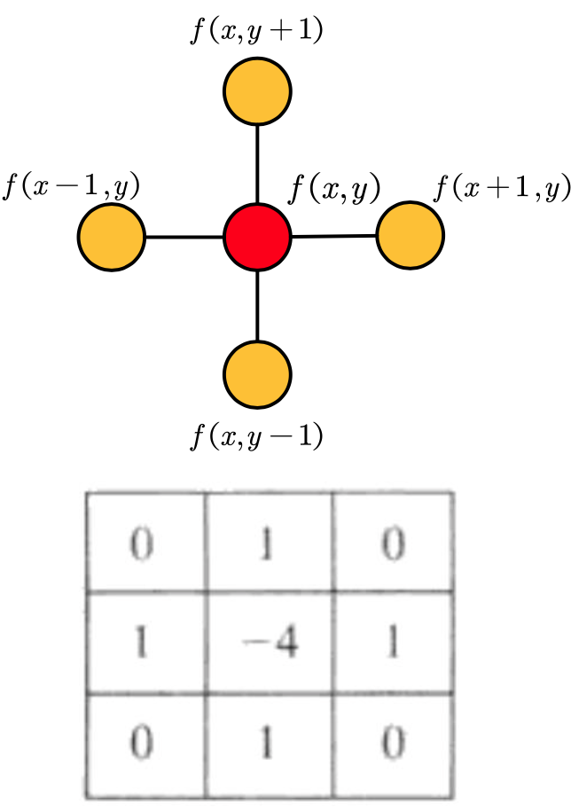

<!-- vscode-markdown-toc -->
* 1. [散度](#散度)
* 2. [拉普拉斯算子](#拉普拉斯算子)
* 3. [离散拉普拉斯算子](#离散拉普拉斯算子)

<!-- vscode-markdown-toc-config
	numbering=true
	autoSave=true
	/vscode-markdown-toc-config -->
<!-- /vscode-markdown-toc -->

# 拉普拉斯矩阵

$$
L = D - A
$$

##  1. 散度

对于向量场 

$$
\begin{aligned} \\
& \overrightarrow{F}(x,y,z) \\
& = [F_{1}(x,y,z),F_{2}(x,y,z),F_{3}(x,y,z)] \\
& = F_{1}(x,y,z)\overrightarrow{i} + F_{2}(x,y,z)\overrightarrow{j} + F_{3}(x,y,z)\overrightarrow{k}
\end{aligned}
$$

散度:

$$
div\overrightarrow{F} = \frac{\partial {F_1}}{\partial {x}} + \frac{\partial {F_2}}{\partial {y}} + \frac{\partial {F_3}}{\partial {z}}
$$

散度的内积表达方式:

$$
\nabla = [\frac{\partial {}}{\partial {x}}, \frac{\partial {}}{\partial {y}}, \frac{\partial {}}{\partial {z}}]
$$

所以有:

$$
\nabla \cdot \overrightarrow{F} = [\frac{\partial {}}{\partial {x}}, \frac{\partial {}}{\partial {y}}, \frac{\partial {}}{\partial {z}}] \cdot [F1, F2, F3] = \frac{\partial {F_1}}{\partial {x}} + \frac{\partial {F_2}}{\partial {y}} + \frac{\partial {F_3}}{\partial {z}}
$$

##  2. 拉普拉斯算子
函数 $f$ 的拉普拉斯算子 $\bigtriangledown ^ 2f$ 也可以写成 $\bigtriangledown \cdot \bigtriangledown f$, 定义为 $f$ 梯度的向量场的散度。

函数 $f(x)$ 的梯度 

$$
\nabla{f} = \frac{\partial {f}}{\partial {x}}\overrightarrow{i} + \frac{\partial {f}}{\partial {y}}\overrightarrow{j}+\frac{\partial {f}}{\partial {z}}\overrightarrow{k}
$$

作为向量场 
$$
\overrightarrow{F}(x,y,z) = \nabla{f} = \frac{\partial {f}}{\partial {x}}\overrightarrow{i} + \frac{\partial {f}}{\partial {y}}\overrightarrow{j}+\frac{\partial {f}}{\partial {z}}\overrightarrow{k}
$$

那么梯度的向量场散度就是:

$$
div\nabla{f} = \nabla\cdot\nabla{f} = \nabla^{2}{f} \\
=  \frac{\partial ^2{f}}{\partial {x}^2} + \frac{\partial^2 {f}}{\partial {y}^2}+\frac{\partial^2 {f}}{\partial {z}^2}
$$

##  3. 离散拉普拉斯算子

### 一阶导数

$$
\frac{\partial {f}}{\partial {x}} = \lim\limits_{\epsilon\to+\infty}
\frac{f(x+\epsilon) - f(x)}{\epsilon}
$$

$$
\frac{\partial {f}}{\partial {x}} = \frac{f(x+1) - f(x)}{x+1-x} = f(x+1) - f(x)
$$

二阶导数
$$
\frac{\partial ^2{f}}{\partial {x}^2} = \lim\limits_{\epsilon\to+\infty}
\frac{[f(x+\epsilon) - f(x)] - [f(x) - f(x-\epsilon)]}{\epsilon^2}
$$

$$
\frac{\partial ^2{f}}{\partial {x}^2} = (f(x+1) - f(x)) - (f(x) - f(x-1)) \\
= f(x+1) - f(x-1) - 2f(x)
$$

离散梯度向量场的散度,也就是拉普拉斯算子:
$$
\nabla^{2}{f} = \frac{\partial ^2{f}}{\partial {x}^2}
= f(x+1) + f(x-1) - 2f(x)
$$

对于二维的拉普拉斯算子:

$$
\nabla^{2}{f} = \frac{\partial ^2{f}}{\partial {x}^2} + \frac{\partial ^2{f}}{\partial {y}^2} \\
= [f(x+1, y) + f(x-1, y) - 2f(x, y)] + [f(x, y+1) + f(y, y-1) - 2f(x, y)] \\
= f(x+1, y) + f(x-1, y) + f(x, y+1) + f(y, y-1) - 4f(x, y)
$$

## 图上拉普拉斯算子

图上任意一个节点拉普拉斯算子可以计算一个点到它所有自由度上微小扰动的增益。

$$
\nabla^2 f_{i} = \sum_{j \in E_{ij}}(f_{i} - f_{j}) \\
= d_{i}f_{i} - \sum_{j\in E_{ij}}{f_j}
$$

所有的 $N$ 个节点放在一起:

$$
\nabla^2 f
= \begin{bmatrix}
\nabla^2 f_{1} \\ 
\vdots \\
\nabla^2 f_{N} \\
\end{bmatrix} 
=\begin{bmatrix}
d_{1}f_{1} - \sum_{j\in E_{1j}}{f_j} \\ 
\vdots \\
d_{N}f_{N} - \sum_{j\in E_{Nj}}{f_j} \\
\end{bmatrix} 
=
\begin{bmatrix}
d_{1} \\ 
& \ddots \\
& & d_{N} \\
\end{bmatrix} 
\begin{bmatrix}
f_{1} \\ 
\vdots \\
f_{N} \\
\end{bmatrix} 
-
A\begin{bmatrix}
f_{1} \\ 
\vdots \\
f_{N} \\
\end{bmatrix} 
= (D - A)\begin{bmatrix}
f_{1} \\ 
\vdots \\
f_{N} \\
\end{bmatrix} 
= (D-A)f
$$

其中 $A$ 邻接矩阵, $D$ 是度。

拉普拉斯矩阵就是: $L = D - A$, 

symmetric: 

$$
L_{sym} = D^{-1/2}LD^{-1/2} = I - D^{-1/2}AD^{-1/2}
$$

其中

其中:

$$
D^{-1/2} = \begin{bmatrix}
d^{-1/2}_{1} \\ 
& d^{-1/2}_2 \\
& & \ddots \\
& & & d^{-1/2}_n \\
\end{bmatrix}
$$

$$
L_{sym} = [i,j] = 
\left\{\begin{matrix}
   1, \quad  if \quad i=j \\
   -1 / \sqrt{deg(v_i)deg(v_j)}, \quad if \quad & e_{ij} \in E \\
   0, \quad otherwise
\end{matrix}\right.
$$

# 参考

* [B站散度介绍](https://www.bilibili.com/video/BV1a5411Y7Jx?p=2&share_source=copy_web)
* [知乎拉普拉斯算子推导](https://zhuanlan.zhihu.com/p/85287578)
* [知乎另一个拉普拉斯矩阵解释](https://zhuanlan.zhihu.com/p/67336297)

