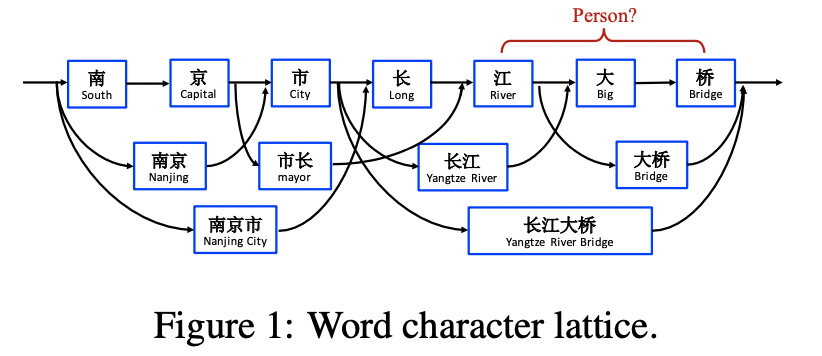
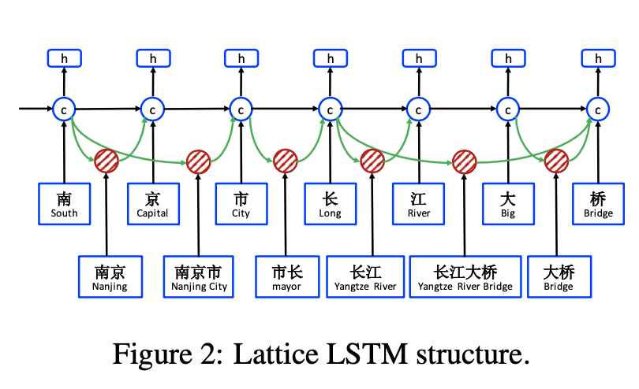
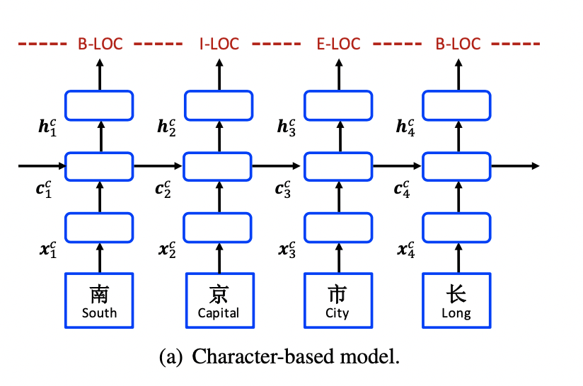
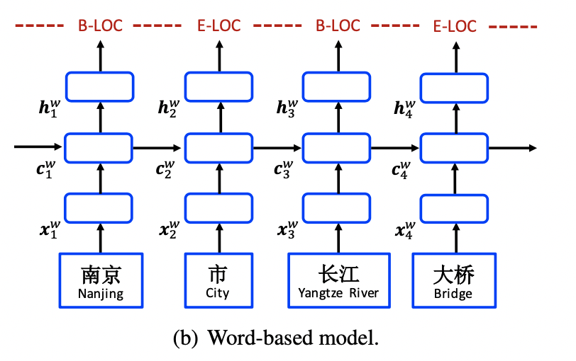
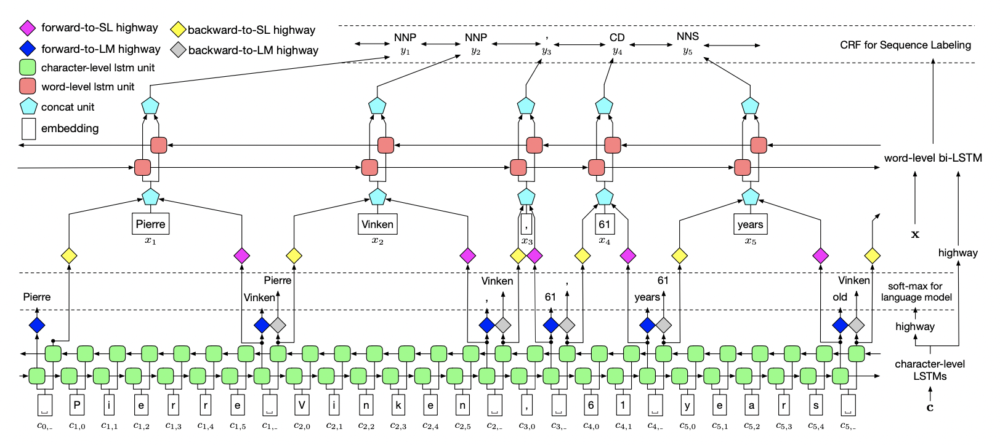
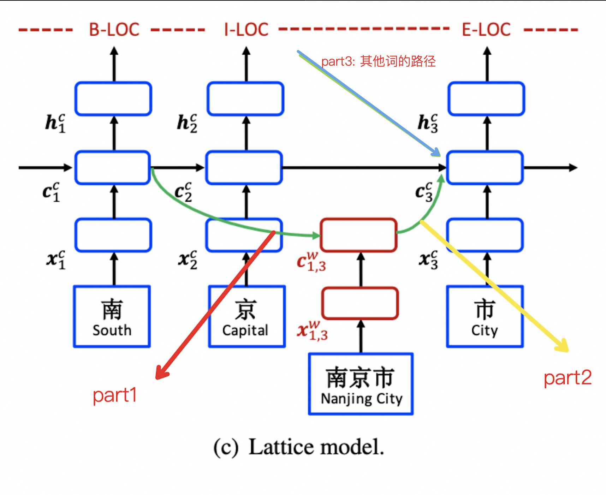
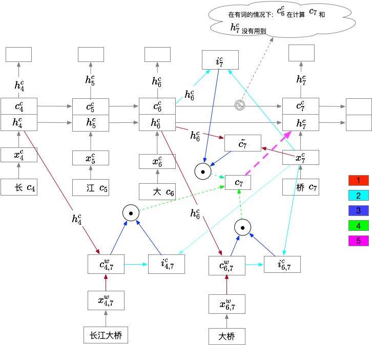

# Chinese NER Using Lattice LSTM

[论文地址](https://www.aclweb.org/anthology/P18-1144/)

## 摘要

## 介绍

使用一个巨大的词汇表，来辅助区分歧义，比如 "江大桥" 作为一个 "PER" 的歧义问题。
由于对于一个 lattice 来说，有多个潜在的路径，所以重新设计了一个 lattice LSTM 结构。
如下图:

从上图，可以看到到每一个字符会有多条路径，所以会设计 gate 来自动整合所有路径的信息。对比与 word，该结构免于分词的错误问题。

## 模型

我们使用最好的英文 NER 模型(Huang et al., 2015; Ma and Hovy, 2016; Lample et al., 2016), 使用 LSTM-CRF 作为主要的网络结果。形式化定义如下，一个输入的句子表示为 $s = c_1,c_2,...,c_m$, 其中 $c_j$ 表示第 $j$ 个字符（注意是字符，不是词)。同样，$s$ 也可以被看做词的序列 $s=w_1,w_2,...,w_n$, 其中 $w_i$表示在句子中的第 $i$ 个词，这些词是通过中文分词工具得到的。我们使用 $t(i,k)=j$ 第 $i$ 个词中 第 $k$ 个字符在在整个句子中以字为粒度的 index $j$。

以图1为例, 如果分词是 "南京市 长江大桥", 那么 $t(2,1)=4$(长), $t(1,3)=3$(市)。解释如下:

* $t(2,1)$ 表示第2个词中，第1个字，也就是 "长", 而 "长" 在句子中的 index 是 4. (句子是没有空格的，空格是为了方便看分词结果)
* $t(1,3)$ 表示第1个词中，第3个字，也就是 "市", 在句子中的 index 是 3.

我们使用 BIEOS scheme 来标注。

### Character-Based Model

Character-based 的模型，如果图3(a) 所示。 使用 LSTM-CRF 在字序列上建模，$c_1, c_2, ..., c_m$. 每一个字 $c_j$ 被表示成:

$$
x_{j}^{c} = e^{c}{c_j}
$$

其中 $e^c$ 表示字的 embedding 向量。

双向的 LSTM 被应用到 $x_1, x_2, ..., x_m$ 来得到 $\overrightarrow{h_1^c}, \overrightarrow{h_2^c}, ..., \overrightarrow{h_m^c}$ 和 $\overleftarrow{h_1^c}, \overleftarrow{h_2^c}, ..., \overleftarrow{h_m^c}$, 在 left-to-right 和 right-to-left 两个方向上，相应的设置两组不同的参数。最后的每一个字的 hiddeng 向量表示是:

$$
h_j^c = [\overrightarrow{h_j^c};\overleftarrow{h_j^c}]
$$

然后是 CRF 模型作用在 $h_1^c, h_2^c, ..., h_m^c$ 进行序列标注。

#### Char + bichar

Bigram 字在分词上已经被证明是有效果的。我们在 character-based 的模型基础上增加 bigram 的信息，可以对模型进行增强。

$$
x_j^c = [e^c{c_j};e^b({c_j,c_{j+1}})]
$$

其中，$e^b$ 表示 bigram 字的 embedding 字典。

#### Char + softword

通过在基于字的 NER 模型中增加分词的 soft featrues是能够提升性能的(Zhao and Kit, 2008; Peng and Dredze, 2016)。我们通过将分词的 label embedding 与 字的 embedding 链接在一起来增强表示。

$$
x_j^c = [e^c{c_j};e^s(seg(c_j))]
$$

其中 $e^s$ 代表了分词 label 的 embedding 信息。 $seg(c_j)$ 表示对于 $c_j$ 给与分词的 label。我们使用 BMES scheme 来表示分词的信息(Xue, 2003)。

* 分词 label: 指的是 BMES scheme, 每一个字都会有一个 BMES schema. 引入了这个 embedding 信息。所以 $seg(c_j)$ 实际上就是 "B-V", "E-V" 这种 label. 其实就是引入了词性信息。

就像 Character-based 一样，最后会加一个 CRF 模型。

### Word-Based Model

Word-based 模型参考图3(b)。 $e^w(w_i)$ 作为 $w_i$ 的 embedding 表示:

$$
x^w_i = e^w(w_i)
$$

其中 $e^w$ 表示 embedding tabel. 以及双向的 LSTM.

#### 集成字表示

基于字的 CNN 和 LSTM 都可以用来做为一个词内的字序列的表示。两者我们都试验了。使用 $x_i^c$ 表示在 $w_i$ 中字符序列的表示，那么就有

$$
x_i^w = [e^w(w_i); x_i^c]
$$

#### Word + char LSTM

每一个字的 embedding 使用 $e^c(c_j)$ 来表示。使用 bi-lstm 来作为在 $w_i$ 中字符序列的表示。最终的表示是:

$$
x_i^c = [\overrightarrow{h^c_{t(i,len(i))}}; \overleftarrow{h^c_{t(i,1)}}]
$$

也就是取双向 lstm 最后一个隐向量，拼接在一起。

#### Word + char LSTM'

我们还另外开发了一种有变化的 word + char LSTM 模型。该模型使用独立的 Bi-LSTM 来得到 $\overrightarrow{h^c_j}$ 和 $\overleftarrow{h^c_j]$。

$$
x_i^c = [\overrightarrow{h^c_j}; \overleftarrow{h^c_j}]
$$

注意: 独立的 BI-LSTM 是指，参考了 << Empower Sequence Labeling with Task-Aware Neural Language Model >>  论文中的 LSTM 结构。也就是词的最后一个字的填充 "空格"，该空格的向量，就是 $\overrightarrow{h^c_j}$; 同样，在该词的第一个字的前面填充 "空格"，该空格向量就是 $\overleftarrow{h^c_j}$。

#### Word + CharCnn

对单词内的字序列使用 CNN 建模。参数是 kernel_size = 3, max pooling.

### Lattice Model

Lattice 结构如图2，该模型可以看做是 character-based 模型的扩展, 它集成了 word-base 的 cell 和 额外的控制信息流的 gate。

如图3(c)所示。

模型的输入是字序列 $c_1,c_2,...,c_m$ 以及每一个字在词汇表 $\mathbb{D}$ 匹配的词。例如: "南京市" 这些序列在 $\mathbb{D}$ 中有被匹配到。我们使用了一个巨大的文本构建了词汇表 D。

* $w^d_{b,e}$ : 表示以 $[b, e]$ 区间的词向量。在图1中: $w^d_{1,2}$ = "南京" 词向量; $w^d_{7,8}$ = "大桥" 词向量。（"大桥" 是 $w^d_{6,7}$ 吧?)
  
对于 LSTM 来说，四个门对应着四个向量, "输入向量", hidden vector 以及 cell vecotr 和 gate vector. 字的输入向量使用:

$$
x_j^c = e^c(c_j)
$$

来表示, $c_j$ 的字向量。

对于基于字的循环神经网络来说，对于每一个字 $c_j$ 会产生 cell vecotr $c^c_j$ 和 hidden vector $h^c_j$。然后 $h^c_j$ 会用于 CRF。

基本的 LSTM 函数计算如下:

$$
\begin{bmatrix}
i^c_j \\
f^c_j \\
o^c_j \\
\tilde{c}^c_j \\
\end{bmatrix}

=

\begin{bmatrix}
\sigma \\ 
\sigma \\
\sigma \\
tanh \\
\end{bmatrix}
(W^{cT}\begin{bmatrix}
x^c_j \\
h^c_{j-1}
\end{bmatrix}
+ b^c)
$$

$$
c^c_j = f^c_j \odot c_{t-1} +  i^c_j \odot \tilde{c}^c_j \\
h^c_j = o^c_j \odot tanh(c^c_j)
$$

与 character-based 模型不同的是， $c^c_j$ 现在需要考虑词表的子序列 $w^d_{b,e}$。每一个 $w^d_{b,e}$ 的 embedding 表示如下:

$$
x^w_{b,e} = e^w(w^d_{b,e})
$$

其中 $e^w$ 表示 embedding 向量表。

如何将 word 的信息加进去? 看图3, 分两个部分计算:

* part1: 计算 word cell, 也就是当前 word embedding 信息与 $w^d_b$(也可以称作 $c_b$) 也就是 word 的开始 字 信息结合在一起。
* part2: part1 计算好的 word cell, 如何与当前字，也就是 $w^d_e$(也可以称作 $c_e$) 信息结合在一起。也就是与当前字计算 gate, 表示多少信息会与当前字结合。
* part3: 多条路径的合并，是最后一步

**part1 - 计算 word cell**

现在增加 word cell, 使用 $x^w_{b,e}$ 来表示 $c^w_{b,e}$，计算公式如下:

$$
\begin{bmatrix}
i^w_{b,e} \\
f^w_{b,e} \\
\tilde{c}^w_{b,e} \\
\end{bmatrix}
=
\begin{bmatrix}
\sigma \\
\sigma  \\
tanh \\
\end{bmatrix}
(W^{wT} 
\begin{bmatrix}
x^w_{b,e} \\
h^c_b  \\
\end{bmatrix}
+ b^w)
$$

$$
c^w_{b,e} = f^w_{b,e} \odot c^c_b + i^w_{b,e} \odot \tilde{c}^w_{b,e}
$$

这样的解释是计算 $c^w_{b,e}$ 是将 $h^c_b$ 也就是 $b$ 位置的隐向量与 词向量 $x^w_{b,e}$ 拼接，通过输入门 $i^w_{b,e}$ 遗忘门 $f^w_{b,e}$ 和 Cell $\tilde{c}^w_{b,e}$ 来计算当前实际的 $c^w_{b,e}$。这里是没有输出门的，因为输出门是将 char 与 word 整合后，最终作用的。比如: "大桥"，"长江大桥"，每一个都是 $c^w_{b,e}$, 分别是 $c^w_{6,7}$ = "大桥"; $c^w_{4,7}$ = "长江大桥"。

**part2 - 计算 word cell 的 gate**

也就是需要计算 $c^w_{b,e}$ 如何与 $c^c_e$ 和链接的 gate.

$$
i^c_{b,e} = 
\sigma(
W^{lT}
\begin{bmatrix}
c^w_{b,e} \\
x^c_e  \\
\end{bmatrix}
+ b^l
)
$$

**part3 - 计算多个路径$x^w_{b,j}$以及$x^c_j$ 合并的 $c^c_j$**

$$
c^c_j = (\sum_{b \in \{b'|w^d_{b',j} \in \mathbb{D}\}} {\alpha^c_{b,j} \odot c^w_{b,j}} )+ \alpha^c_j \odot \tilde{c^c_j}
$$

注释: 现在有多个路径以及多个 gate, 那么如何拼成 $c^c_j$ 呢？就是按权重进行拼接, 前面已经计算出 $i^c_{b,j}$ (词) 和 $i^c_j$(字，正常的 lstm计算的), 拼接在一起，就是权重均值化后拼接。

所以:

$$
\alpha^c_j = exp(i^c_j) / (exp(i^c_j) + \sum_{b' \in \{b''|w^d_{b'',j} \in \mathbb{D}\}}{i^c_{b',j}})
$$

$$
\alpha^c_{b,j} = exp(i^c_{b,j}) / (exp(i^c_j) + \sum_{b' \in \{b''|w^d_{b'',j} \in \mathbb{D}\}}{i^c_{b',j}})
$$

最后的 $h^c_j$ 依然使用先前的计算方法:

$$
h^c_j = o^c_j \odot tanh(c^c_j)
$$

问题：

* 如果没有到当前字的词，那么还是原有的 LSTM的计算方法吗？是的，与常规LSTM计算是一样的。
* 当前字有词的情况下，是没有 $f^c_j \odot c_{t-1}$ 这个计算的取而代之的是用词的 $f^w$ 来计算的？是的，在有词的情况下 $f^c_j \odot c_{t-1}$ 是没有被使用的。

全部公式列表:
$$
\begin{bmatrix}
i^c_j \\
f^c_j \\
o^c_j \\
\tilde{c}^c_j \\
\end{bmatrix}

=

\begin{bmatrix}
\sigma \\ 
\sigma \\
\sigma \\
tanh \\
\end{bmatrix}
(W^{cT}\begin{bmatrix}
x^c_j \\
h^c_{j-1}
\end{bmatrix}
+ b^c)
$$

$$
c^c_j = f^c_j \odot c_{t-1} +  i^c_j \odot \tilde{c}^c_j \\
h^c_j = o^c_j \odot tanh(c^c_j)
$$

$$
\begin{bmatrix}
i^w_{b,e} \\
f^w_{b,e} \\
\tilde{c}^w_{b,e} \\
\end{bmatrix}
=
\begin{bmatrix}
\sigma \\
\sigma  \\
tanh \\
\end{bmatrix}
(W^{wT} 
\begin{bmatrix}
x^w_{b,e} \\
h^c_b  \\
\end{bmatrix}
+ b^w)
$$

$$
c^w_{b,e} = f^w_{b,e} \odot c^c_b + i^w_{b,e} \odot \tilde{c}^w_{b,e}
$$

$$
i^c_{b,e} = 
\sigma(
W^{lT}
\begin{bmatrix}
c^w_{b,e} \\
x^c_e  \\
\end{bmatrix}
+ b^l
)
$$

$$
c^c_j = (\sum_{b \in \{b'|w^d_{b',j} \in \mathbb{D}\}} {\alpha^c_{b,j} \odot c^w_{b,j}} )+ \alpha^c_j \odot \tilde{c^c_j}
$$

$$
\alpha^c_j = exp(i^c_j) / (exp(i^c_j) + \sum_{b' \in \{b''|w^d_{b'',j} \in \mathbb{D}\}}{i^c_{b',j}})
$$

$$
\alpha^c_{b,j} = exp(i^c_{b,j}) / (exp(i^c_j) + \sum_{b' \in \{b''|w^d_{b'',j} \in \mathbb{D}\}}{i^c_{b',j}})
$$

$$
h^c_j = o^c_j \odot tanh(c^c_j)
$$

全面解析图:

  
### Decoding 和 训练

## 实现

gaz 构建:

1. 通过 gaz 预训练好的词向量文件，构建 trie
2. 通过 trie， 对 train, dev 的句子，看命中 trie的词，构成了 gaz 词汇表
3. 用 gaz 预训练好的词向量+词汇表，产生一份 gaz 预训练好的词汇表

