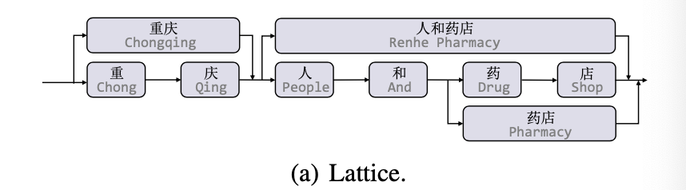
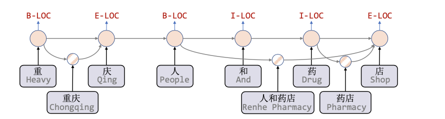
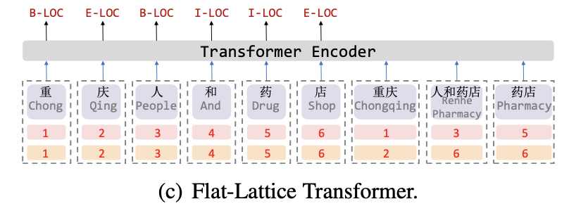

# FLAT: Chinese NER Using Flat-Lattice Transformer

[论文地址](https://www.aclweb.org/anthology/2020.acl-main.611/)

## 摘要

最近, character-word lattice 结构已经被证明在中文 NER 上通过集成词的信息是有效的。可是， lattice 结构很复杂而且是动态的，目前存在的 lattice-based 的结构都很难在 GPU 上并行。在该论文中，我们提出了 FLAT: Flat-LAttice Transformer for Chinese NER, 用于将 lattice 打平到统一的结构里。每一个 span 对应一个字或词以及在 lattice 中的位置。由于 Transformer 的强大以及良好的 position encoding, FLAT 完全的利用了 lattice 信息并且有出色的并行能力。在四个数据集上， FLAT 在性能和效率上都超过了其他 lexicon-based 模型。

## 介绍

NER 在很多下游任务中扮演一个非独立的角色。与英文 NER 相比，中文 NER 由于没有分词，所以难了许多。

最近, lattice 结构被证明使用词的信息以及避免分词的错误传播是有极大帮助的。我们能够通过句子匹配词表得到很多潜在的词，然后，我们就得到了一个 lattice. 如图1a.

Lattice 是一个又向循环图，每一个节点是一个字或词。Lattice 包含了字与潜在词的序列。他们不是顺序排列的，词的第一个字和最后一个字决定了他的位置。一个在 lattice 中的词对 NER 来说可能非常重要。例如图1, "人和药店" 可以被用来区分 "重庆" 和 "重庆人".

有两个方法可以利用 lattice. (1) 方法1是设计一个模型来兼容 lattice 输入，比如 Lattice LSTM 和 LR-CNN。在 Lattice LSTM 中，额外的词 cell 被用来编码潜在的词,同时 attention 机制被用来融合不同的位置的节点，如图1b.

LR-CNN 则使用 CNN 来编码潜在的词。可是，RNN 和 CNN 都是难以建模 long-distance 依赖，而这种对于实体识别可能是有用的，比如实体共指。由于动态的 lattice 结构, 这些方法都不能完全的利用 GPU 的并行计算。（2）另外一个方法是将 lattice 转化成 GNN来编码，比如 Lexicon-based Graph Network 和  Collaborative Graph Network。而顺序结构对 NER 来说依然是非常重要的，图的这种对应依然会有差距。（这句话的大致意思是说，就比如 C-graph, 使用了 GAT，但是词的字依然是有顺序的)。这些方法都需要 LSTM 做为 encoder 来处理顺序的归纳偏差，从而使得模型复杂。

在这篇论文中，我们提出了 FLAT。Transformer 利用了自注意力以及 long-distance 依赖。为了保持 position 信息，Transformer 使用了 position 表示。受到 position 表示的启发，我们设计了一个巧妙的位置编码，如图1c所示。

细节上，我们为每一个 token (word 和 character) 赋值了两个 position 索引: head position 和 tail position, 并基于此我们重新构建了 lattice. 因此，我们能够直接使用 Transformer 作为 lattie 的输入。Transformer 的 self-attention 机制能够直接将字与潜在的词进行交互，这包括 self-matched words. 对于一个字来说，他的 self-matched 词表示了包含他的词。例如，在图1a中，"药"的 self-matched 词是 "任何药店" 和 "药店"。试验表明我们模型比其他的 lexicon-based 模型在性能和推断速度上更胜一筹。

## 背景

在这个部分，我们简要的介绍下 Transformer 结构。聚焦在 NER task, 我们仅仅讨论 Transformer encoder. 他由 self-attention 和 feedforward (FFN) 网络结果组成。每一个 sublayer 由残差网络和 layer normalization 链接。 FFN 是一个位置相关的多层感知机。 Transformer 执行 $H$ heads self-attention. 为了简单，我们忽略 head。每一个 head 的结果可以被如下计算:

$$
Att(A, V) = softmax(A)V,
\\
A_{ij} = (\frac{Q_{i}K^T_j}{\sqrt{d_{head}}})
\\
[Q, K, V] = E_x[W_q, W_k, W_v]
$$

其中 $E$ 是 embedding table 或者 transformer 最后一层输出。 $W_q, W_k, W_v \in \mathbb{R}^{d_{model} \times d_{head}}$ 是学习的参数，并且 $d_{model} = H \times d_{head}$, $d_{head}$ 是每一个 head 的维度.

Vanilla Transformer 使用了绝对位置编码来捕获序列信息。受到  Yan et al. (2019)的启发，我们考虑到在 selft-attention 中，向量的内积将会导致方向的丢失。因此，我们在 lattice 中使用相对位置。

## 模型

### 转换 Lattice 到 Flat 结构

在从词汇表中得到 lattice 后，我们将 lattice 打平。 打平的 lattice 可以被定义为一系列的 span, 一个 span 对一个 token (word 或 character), 包含一个 head 和 一个 tail, 如图1c. Token 是 character 或 word. Head 和 tail 表示在原始的序列中对应的第一个和最后一个 position index, 并且他们指示了 token 在 lattice 中的位置。对于字来说，head 和 tail 是一样的。有一个非常简单的算法来恢复 flat-lattice 到原先的 lattice 结构。我们通过提取 head 和 tail 相同的 token 构建字序列。然后，我们使用其他带有 head 和 tail 的词构建 lattice 的 skip-paths. 由于我们的变换是可恢复的，所以我们假设 flat-lattice 能够维持原始的 lattice 结构。

### Span 的相对位置编码

Flat-lattice 结构包含带有不同长度的 span. 为了编码 span 间的交互，我们提出了相对位置的 span 编码。对于两个在 lattice 中的 span $x_i$ 和 $x_j$, 由他们的 head 和 tail 决定了三种关系: 相交，包含，独立。我们使用了一个稠密向量来建模他们的关系，来代替直接对三种关系的直接编码。这个向量由 head 和 tail 的信息转换而来。因此，我们认为他们不仅能够表示两个 token 之间的关系，而且能够表示出更多的详细信息，诸如 一个 character 和 一个 word 的距离。使用 $head[i]$ 和 $tail[i]$ 来表示 span $x_i$ 的 head 和 tail. 四种不同的相关距离在 $x_i$ 和 $x_j$ 之间可以如下表示:

$$
d^{(hh)}_{ij} = head[i] - head[j], \\
d^{(ht)}_{ij} = head[i] - tail[j], \\
d^{(th)}_{ij} = tail[i] - head[j], \\
d^{(tt)}_{ij} = tail[i] - tail[j], 
$$

其中 $d^{(hh)}_{ij}$ 表示了 $x_i$ 和 $x_j$ head 的距离，其他 $d^{(ht)}_{ij}, d^{(th)}_{ij}, d^{(tt)}_{ij}$ 有相同的意思。最后的 span 的相对为编码是一个简单的4个距离的非线性变换:

$$
R_{ij} = ReLU(W_r (p_{d^{(hh)}_{ij}} \oplus p_{d^{(ht)}_{ij}} \oplus p_{d^{(th)}_{ij}} \oplus p_{d^{(tt)}_{ij}}))
$$

其中 $W_r$ 是线性变换参数， $\oplus$ 表示 concat 操作, $p_d$ 有下面的公式计算:

$$
p^{(2k)}_d = sin(d/10000^{2k/d_{model}}) \\
p^{(2k+1)}_d = cos(d/10000^{2k/d_{model}})
$$

其中 $d$ 是 $d^{(hh)}_{ij}, d^{(ht)}_{ij}, d^{(th)}_{ij}, d^{(tt)}_{ij}$, $k$ 表示位置编码维度中的 index (也就是比如 512维, 其中 2k 就是 512 中的偶数; 2k+1 就是 512 中的奇数)。然后，我们使用了 self-attention 思想来设计了相对位置编码，如下:

$$
A^{*}_{i,j} = W^T_q E^T_{x_j} E_{x_i} W_{k,E} + W^T_q E^T_{x_i}R_{ij}W_{k,R} + u^TE_{x_j}W_{k,E} + v^TR_{ij}W_{k,R}
$$

其中 $W_q, W_{k,R}, W_{k, E} \in \mathbb{R^{d_{model} \times d_{head}}}$

**注:相对位置公式理解**

这样的相对位置计算其实在 TransformerXL 中已经用到了. 计算思路如下，因为是 Attention, 对于 $x_i$的向量表示是:

$x_i = E_i \oplus P_i$, 同样有
$x_j = E_j \oplus P_j$, 当进行 attention的时候，有:

$x_i \cdot x_j = (E_i \oplus P_i) \cdot (E_j \oplus P_j) = E_i \cdot Ej + E_i \cdot P_j + E_j \cdot P_i + P_i \cdot P_j$

现在做相对位置转换，把其中含有 $i$ 的全部替换掉，如下:

1. $E_i \cdot Ej \Longrightarrow   W^T_q E^T_{x_j} E_{x_i} W_{k,E}$ - 这部分没有改变，因为不涉及位置
2. $E_i \cdot P_j \Longrightarrow  W^T_q E^T_{x_i}R_{ij}W_{k,R}$ - 这个部分要改变因为 $P_j$ 是绝对位置需要用相对位置替代。
3. $E_j \cdot P_i \Longrightarrow u^TE_{x_j}W_{k,E}$ - 这部分需要改变，直接将 $P_i$ 去掉了。
4. $P_i \cdot P_j \Longrightarrow v^TR_{ij}W_{k,R}$ - 这部分需要改变，两个位置的计算，刚好是相对位置的计算。

然后，我们使用 $A^*$ 替代等式1中的 $A$，其他的计算与常规的 Transformer 一样。

在 FLAT 之后，我们仅仅将 character 的序列表示放入 CRF.

## 试验
