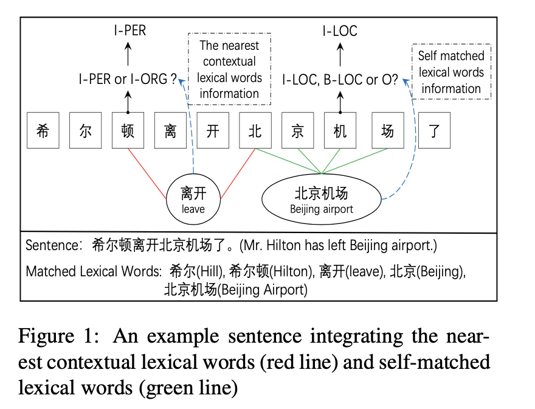
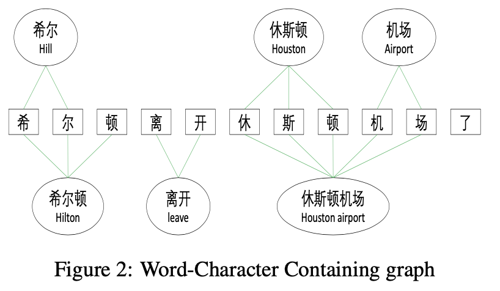
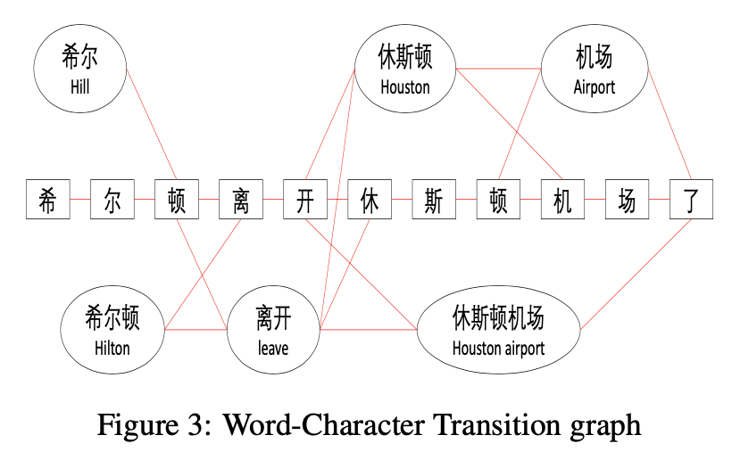
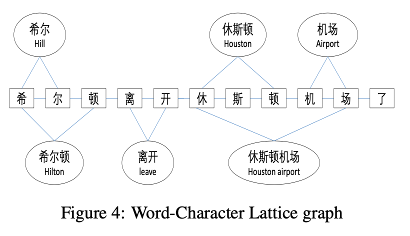
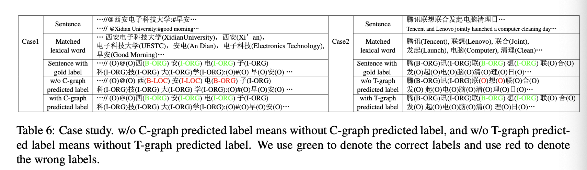

# Leverage Lexical Knowledge for Chinese Named Entity Recognition via Collaborative Graph Network

[ACL2019 论文地址](https://www.aclweb.org/anthology/D19-1396/)

## 摘要

在中文实体识别系统中，词边界的确实已经被看做一个主要的障碍。幸运的是，自动构建的词典包含了丰富的词边界和语义信息。可是，当遇到自匹配和邻近匹配的词的时候，将词汇的知识融入到中文 NER 任务处理中依然面临着挑战。我们提出了 Collaborative Graph Network 来解决这些问题。试验表明，我们不仅仅超过了 SOTA 而且比 SOTA 模型加速了 6-15倍。

## 介绍

NER 任务是为了在一段非结构化的文中对词或者表达进行定位和分类，例如 人名，地点，组织机构等。NER 是很多 NLP 应用的预处理阶段，比如关系识别，事件抽取，问答等。在英文的 NER 任务中， LSTM-CRF 模型通过使用词级别和字级别的表达达到了 SOTA 结果。

在该文章中，我们聚焦在中文 NER。与英文对比来说，中文没有明相的词边界。因为没有词的边界信息，所以只能直接的使用字的信息。但是这样的方法忽视了词信息。可是，词的信息在中文的 NER 中确实非常的有用。例如图1所示，"北京机场"这个词的边界就与"北京机场"这个实体的边界完全一样。因此，完全的利用好词的信息是有助于提升中文 NER 的性能的。

有三种主要的方式来将词的信息合并入中文 NER 中。第一种是 pipline 方法。该方法先进行中文分词（CWS），然后使用 word-based NER 模型。可是，pipline 的方法会受到分词工具的错误传播，分词工具的错误会影响 NER 性能。第二种方法是将 CWS 和 NER 两个任务进行联合学习，这种方法则必须依赖 CWS 的标注语料，这种标注是昂贵的，同时标注的标注也不同。（分词的粒度是有个字不同的标注的，例如: 中共中央总书记，就可以作为一个词，也可作为两个词）。第三种方法，就是利用自动构建的词典，该词典是基于大量自动分割好的文本上得到的。词汇知识包含边界以及语义信息。边界信息又词汇自身提供，而语义信息则是通过预训练好的词向量提供。与联合学习方法对比，词典是非常容易获得，而也不需要标注的 CWS 数据集。最近，lattice LSTM 被提出在 NER 任务上集成了词汇知识。可是，在句子中集成词汇知识依然面临着两大挑战。

第一个挑战是集成 self-matched 词。一个字的的 self-matched 词指的是包含这个字的词汇表中的词。例如: "北京**机**场" 和 "**机**场" 是 "**机**" 的 self-matched词。"离开" 就是 "**机**" 的 self-matched 词，因为 "**机**" 并没有被包含在 "离开" 中。Self-matched 的词汇信息在中文 NER 中是非常有用的。例如 图1, self-matched 词 "北京机场" 能够帮助 "机" 来预测 "I-LOC" 标签，而不是 "O" 或者 "B-LOC" 标签("B-LOC" 是说，因为 "机" 在中间，所以不会被识别成 "B-LOC")。可是，由于 字-词 的 lattice 限制，所以在 lattice LSTM 模型中，并没有集成这种 self-matched 词 "北京机场" 到 "机" 当中。（Lattice LSTM 的问题之一)

第二个挑战是直接集成 nearest contextual 词汇信息。一个字的 nearest contextual 词是指该词语与该字的最近的前面或后面的子序列匹配。例如，"离开" 是 "顿" 这个字的最近上下文词汇。而 "北京" 就不是最近上下文词汇。最近上下文词汇对中文 NER 来说是非常有益的。例如图1所示，直接使用上下文词汇 "离开" 的语义信息，"I-PER" 而非 "I-ORG" 能够预测，因为 "希尔顿" 如果指的是宾馆是不能够与 "离开" 进行搭配的。可是, Lattice Lstm 模型仅仅是隐含的通过隐层的方式集成了最近上下文信息。最近上下文信息可能会被其他信息所干扰。

为了解决以上挑战，我们提出了 character-based Collaborative Graph Netword, 包括 encoding layer, graph layer 以及 funsion layer 和 decoding layer. 具体来说，有三个 word-character graph 在 graph layer。

1. 第一个是 Containing Graph (C-graph), 被用来设计集成 self-matched 词汇。 他用来建模字和 self-matched 词汇的关联。
2. 第二个是 Trainsition graph (T-graph)，用来建模字与最近上下文的关联。他帮助解决直接集成最近上下文的挑战。
3. Lattice Graph (L-graph)，该模型借鉴 Lattice LSTM 的思想。L-graph 隐含了捕获部分的 self-matched 和 nearest contextual 词汇信息。

这三个 graph 没有使用 NLP 的额外工具构建，因此可以避免误差传播问题。除此之外，通过一个 funsion layer 设计将这三个 graph 整合在一起。

我们将我们的模型在各种不同的中文 NER 数据集上进行测试，我们的模型不仅极大的超过了 SOTA 性能，而且提升了 6-15 倍的速度。

总结一下, 我们的主要贡献如下:

* 我们提出了 Collaborative Graph Network 来直接集成词的知识到中文 NER 中。
* 为了解决集成 self-matched 和 nearest contexutal 词的挑战，我们提出了三个字词交互的 graph. 这些 graph 能够在不依赖外部 NLP 工具的同事，捕捉不同的词汇知识和信息。
* 我们在各种中文 NER 数据集上达到了 SOTA，并且我们的模型比 SOTA 加速 6-15倍速度。

## 相关工作

NER. 有非常丰富的文献，包括统计方法，比如 SVM, HMMS。还有相当多的基于神经网络的方法。对于英文，中文没有显著的词边界，因此利用词边界和语义信息是非常重要的。很多工作都使用了词信息作为额外特征。我们的工作是来源于 Lattice LSTM 模型的启发。

Graph convlutional networds. 最近有很多 GCN 的研究。我们的主要工作使用了 GAT。最近，有不少关于 GCN 在 NLP 上应用的文献，一般是使用基于依存语法树来建模。可是，多数工作都严重依赖于使用工具构建一颗依存分析书，这会导致误差传播。为了捕获不同信息的边界和语义，我们提供了 Collaborative Graph Network, 能够有效的避免错误传播问题。根据我们目前的了解，我们是首个将 GAT 应用到中文 NER 任务来自动构建语义图。

## 方法

在这部分，我们首先介绍如何构建图以及集成 self-matched 和 nearest contextual 词信息到句子中。我们然后介绍 Collaborative Graph Netword 作为一个 core 来解决中文 NER 任务。

### 图的构建

为了集成 self-matched 和 nearest contextual 词信息，我们提出了3种 word-character 交互图。首先是 word-character Containing graph (C-graph)。C-graph 帮助捕捉 self-matched 词的边界和语义信息。第二，是 Transition Graph (T-graph). T-graph 的功能是辅助捕获 nearest contexutal 词的语义信息。第三个是 Lattice graph (L-graph). Zhang and Yang (2018) 提出了 lattice 结构，将词的知识嵌入到 LSTM 结构中。我们将 lattice 结构从 LSTM 中释放出来，调整为第三个图。

这三个图共享相同的顶点集合。但是三个图的边集合是完全不同的。顶点集合是有句子中的字以及所有匹配到词典中的词构成的地点集合。例如图一中，顶点集合就是:

$$
V = \{希, 尔, 顿, ..., 机, 场, 了, 希尔, 希尔顿, ..., 北京机场\}
$$

为了表示边的集合，需要介绍下邻接矩阵。邻接矩阵的索引表示顶点对之间是否有边。由于这三个图的边集合是完全不同的，所以这三个图的邻接矩阵分别介绍。

#### Word-Character Containing graph （C-Graph)

对于 C-graph 来说，在句子中的字能够捕获 self-matched 词的边界和语义信息。如图2所示. 如果一个词 $i$ 包含一个字 $j$, 那么, $(i,j)$ 作为 C-graph 中的一条边，对应到邻接矩阵 $A^C$ 中的值被赋予 $1$.

#### Word-Character Transition graph

T-graph 辅助捕获 nearest contextual 词汇语义信息。如图3所示。如果一个词 $i$ 或者一个字
$m$ 匹配上最近的字 $j$ 的子序列, 则将 $(i,j)$ 或 $(m,j)$ 在 T-graph 邻接矩阵中 $A^T$ 将值设置为 $1$. 并且这种捕捉，在词与词之间也是需要的， 也就是 $A^T_{ik}=1$。看下面的不同情形的例子:

* 字与字: "顿" -> "机"
* 字与词: "顿" -> "机场"
* 词与字: "休斯顿" -> "机"
* 词与词: "休斯顿" -> "机场"

注意, T-graph 与被用在中文分词上的切词图是一样的。

#### Word-Character Lattice graph

Zhang and Yang (2018) 提出的 lattice LSTM 使用了词的信息。Lattice 结构能够隐式的捕获一些 self-matched 和 nearest contextual lexical 信息。如图4所示, 字 $m$ 与 字 $j$ 是相邻的，那么有 $A^L_{mj}=1$. 同时，如果一个字 $j$ 与词 $i$ 匹配上，有 $A^L_{ij}=1$

### 模型

Character-based Collaborative Graph Network 包含一个 encoding layer, graph layer, fusion layer 以及 一个 decoding layer. Encoding layer 捕获句子的上下文信息来表示词的语义信息。Graph layer 基于 GAT 在三个图上进行建模。Fusion layer 用来融合三个不同的图信息。最终，是CRF用来解码。

#### Encoding

输入是句子以及所有匹配上的词。我们描述句子用 $s = \{c_1, c_2, ..., c_n\}$, $c_i$ 表示第 $i$ 个字。描述匹配的词用 $l = \{l_1, l_2, ..., l_m\}$. 通过预训练好的字的 embedding matrix, 每一个字的向量表示为:

$$
x_i = e^c_{c_i}
$$

其中 $e^c$ 是预训练好的字的 embedding table.

为了补货上下文信息，使用双向 LSTM 对 $\{x_1, x_2, ..., x_n\}$ 进行建模。双向 LSTM 表示如下:

$$
\overrightarrow{h_i} = \overrightarrow{LSTM}(x_i, \overrightarrow{h_{i-1}})
\\
\overleftarrow{h_i} = \overleftarrow{LSTM}(x_i, \overleftarrow{h_{i-1}})
\\
h_i = \overrightarrow{h_i} \oplus \overleftarrow{h_i}
$$

为了表示词的语义信息，我们查找 word embedding table, $l_i$ 表示一个词, 对应的词向量表示为:

$$
wv_i = e^{w}(l_i)
$$

其中, $e^w$ 是 word embedding table. 我们将隐层输出和 word embedding 作为这一层的数据，表示为 $Node_f$.

$$
Node_f = [h_1, h_2, ..., h_n, wv_1, wv_2, ..., wv_m]
$$

#### 基于 Word-Character 的 GAT

我们使用 GAT 对三个图进行建模。 在一个 M-Layer 的 GAT，输入是 第 $j$ 层的节点特征,

$$
NF^{j} = \{f_1, f_2, ..., f_{N}\}
$$

对应的邻接矩阵 A, $f_i \in \mathbb{R}^{F}$, $A \in \mathbb{R}^{N \times N}$, 其中 $N$ 表示节点的数量, $F$ 是第 $j$ 层的特征维度。 第 $j$ 层的输出新的节点特征:

$$
NF^{j+1} = \{f'_1, f'_2, ..., f'_{N}\}
$$

GAT 有 K个独立的 attention head, 计算如下:

$$
f^{'}_i = \Vert^{K}_{k=1} {\sigma(\sum_{j \in N_i}{ \alpha^k_{ij} W^{k} f_j})}

\\

\alpha^k_{ij} = \frac{exp(LeakyReLU(a^{T}[W^{k}f_i \Vert W^{K}f_j]))} {\sum_{k \in N_i} {exp(LeakyReLU(a^{T}[W^{k}f_i \Vert W^{K}f_k]))} }
$$

**注意** $a^{T}[W^{k}f_i \Vert W^{K}f_j]$ 的运算在实际源码中如下:

$$
a^{T}[W^{k}f_i \Vert W^{K}f_j] = [a^T_i \Vert a^T_j][W^{k}f_i \Vert W^{K}f_j] = a^T_i \cdot W^{k}f_i + a^T_j \cdot W^{K}f_j
$$

也就是，concate 一起的向量再点乘，可以拆分来处理。

其中 $\Vert$ 表示的是 "concat" 操作, $\sigma$ 是非线性激活函数, $\N_i$ 是第 $i$ 个节点的邻居, $\alpha^k_{ij}$ 表示 attention, $W^k \in \mathbb{R}^{F'F}$, $a \in R^{2F'}$ 是 feed-forward 神经网络（就是 Linear 变换)。注意 $f'_i$ 的最终输出维度是 $KF'$， 因为是要将 $K$ 个向量拼接在一起的。最后一层将多个头的 $f_i$ 平均化，得到最终的输出 $F'$.

$$
f^{final}_i = \sigma(\frac{1}{K} \sum_{k=1}^{K} \sum_{j \in N_i} {\alpha^k_{ij}W^{k}f_j})
$$

为了建模不同的图, 我们构建了3个独立的 GAT, 分别是 GAT1, GAT2, GAT3. 由于三个 graph 共享顶点，所以他们的输入都是 $Node_f$, 相应的 Node 表示如下:

$$
G1 = GAT_1(Node_f, A^C) \\
G2 = GAT_2(Node_f, A^T) \\
G3 = GAT_3(Node_f, A^L)
$$

其中的 $G_k \in \mathbb{R}^{F' \times (n+m)}$, $k \in \{1, 2, 3\}$, 其中 $n$ 是 字的 序列长度， $m$ 是词的数量, $n+m$ 就是所有节点的数量， $F'$ 是经过 GAT 后的维度。接下来，通过保留前 $n$ 个，也就是 字的向量，丢弃后 $m$ 个词的向量，就得到了一个新的字表示:

$$
Q_k = G_k[:, 0:n], k \in {1, 2, 3}
$$

#### Fusion Layer

融合层用来将 word-character graph 结果进行混合。融合层的输入是 $H$(字序列的 LSTM 输出) 以及图的输出 $Q_i$, $i \in {1, 2, 3}$. 最终的融合层表示为:

$$
R = W_1H + W_2Q_1 + W_3Q_2 + W_4Q_3
$$

其中 $W_1, W_2, W_3, W_4$ 是可训练的参数。通过融合层我们就得到一个 $R$, $R \in R^{F' \times n}$, 这是新的句子表示，他集成了词的上下文信息，以及 self-matched 和 nearest contextual 词信息。

#### Decoding 和 Training

CRF 略。

## 试验
略。

## Case Study

为了可视化展示我们的模型集成了 self-matched 和 nearest contextual 如何处理这些问题，一个没有 C-graph 和 T-graph 的表格6。在第一个case中，“西安电子科技大学” 带有两个嵌入的实体分别是 "西安" 和 "电子科技大学"。其中，"西安", "电子科技大学", "西安电子科技大学" 这些词通常都在词典中。没有 C-graph, 模型不会将 self-match 识别出 "西安电子科技大学"。在另外一个例子中，"联想" 是一个常规的动词不是一个实体。如果没有 T-graph，"联想" 没有识别出来; 可是有 T-graph，就能够将"腾讯"与"联", "想" 与 "联合" 集成进去，进而正确的识别。

