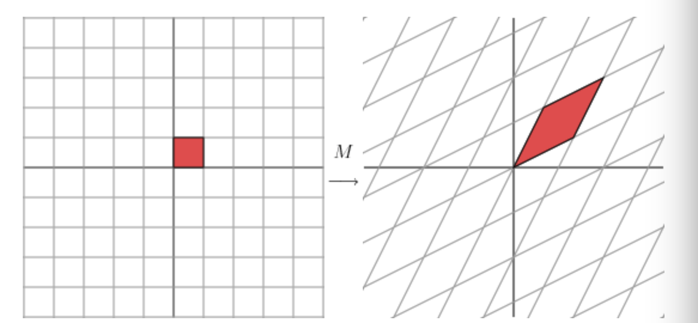
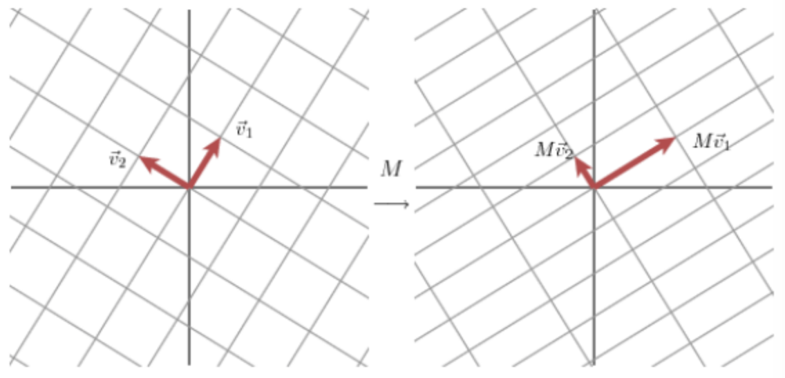
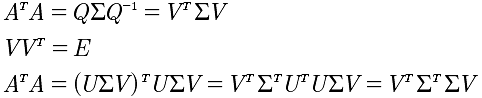
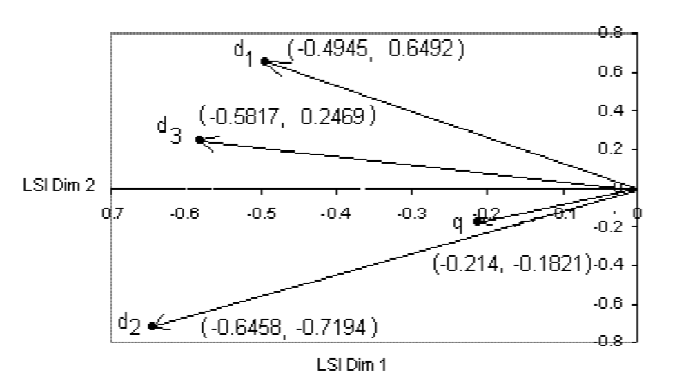

# 词向量
# 语言模型


通过将句子表示成词，在用词的联合概率来表示句子，这就是语言模型的基础。

这个公式表述了一种词和词出现的顺序的。

对于当n=1的时候, p(s)=p(w1)。一般可以通过再句子中增加 BOS 和 EOS 两个标志来表示句子的开始和结束来表述能够解决一些公式处理的麻烦。

# n-gram
n-gram是指 当前词向前n-1个词。如何来简化语言模型的呢？

当n-gram=1，也就是1元语法, 


当n-gram=2，也就是2元语法,


所以n-gram=k的通用表达是:


通过上面可以看到因为n-gram简化了语言模型。那是因为对于n-gram来说，是有一个等价类假设，也就是,对于两个不同的串,h1,h2来说，对于他们共同包含的词分别是wi,wk, wi=wk. 如果h1，从i向前数n-1个词与h2从k向前数n-1个词相同，那么就认为h1=h2.

所以对于p(s)来说 当n=2时，也就是i前面一个词是一样的就认为是等价的, 也就是说 ```wi-1 wi``` 与```w1 w2 ... wi-1 wi``` 是一样的 所以有:

```
p(wi | w1 w2 ... wi-1) = p(wi | wi-1) 
```
上面这个相当于1阶马尔科夫链。

所以对于n-gram来说这是一种简化的假设。

而当n-gram=1的时候，```p(s)=p(w1)p(w2)...p(wn)``` 这就相当于是每一个词的概率就是自身的概率，不像bigram那样，有前一个词的词序信息。而这个表示就相当于从字典中随意拿一个放到句子中组成概率。

所以如果使用统计的语言模型，最差是unigram，一般来说应该选择使用bigram会好一些。

## 概率计算
对于n-gram来说，每一个概率的计算，可以近似使用频率来计算。对bigram来说, 

```p(wi|wi-1) = p(wi-1, wi)/p(wi-1) = count(wi-1,wi) / count(wi-1)```

通过这种计算概率的计算是可以被计算的，因为转换成了count的计算。

将上面的公式统一下就是:

```
p(wi | wi-(n-1),...,wi-1) = count(wi-(n-1),...,wi-1, wi)/count(wi-(n-1),...,wi-1)
```

当进行count计算的时候会出现两个可能的情况, 以bigram为例:

1. count(wi-1,wi) = 0, p = 0
2. count(wi-1,wi) == count(wi), p = 1

显然这两种case都不是不对的，所以需要将这种数据来进行平滑处理。

最简单的平滑就是，count 分子分母都+1, 那么就变成了:

```p(wi|wi-1) = p(wi-1, wi)/p(wi-1) = (count(wi-1,wi) + 1) / (count(wi-1) + 1)```

更复杂的平滑方法，参考<<自然语言处理综述>>.

# 分布表示

分布假说: 上下文相似的词，语义也相似。所以计算出来就带有相似语意信息。

基于分布假说，产出的词的表示就是分布表示。

局部表示: one-hot，产出的词向量是正交的，所以词和词之间没有关系. 分布式表示，就是word2vec的表示。

按照这个逻辑是否，可以改进one-hot? 也就是，将一个词的 上下文的one-hot来作为这个词的表示, 再将所有的one-hot相加，来表示一个词? 感觉这样的词包会好一些。word2vec也是基于这个更进一步。在这里，只是提供一个思路，使用word2vec的这种思想，可以将很多东西转换成vector. 只要这个东西有上下文，比如 命名实体。现在感觉很多东西都可以这样处理，比如 词性，都可以进行embeding. embeding之后就进入了DNN的范畴。再面对问题的时候，可以尝试这样来搞一下。要将四维转换到embeding, dnn上来。这样的好处，就是解决了one-hot中这种绝对正交的问题，因为很多时候两个featrue是有部分关系的，但是使用one-hot则让这种关系消失了，而embeding则会提取出部分相关的特征，例如 名词，人称代词 这两个词性，其实是有部分相交的。

## 分布表示的方法

目前，基于分布假说的方法有3中，基于矩阵的分布表示、基于聚类的分布表示、基于神经网络的分布表示。

核心思想，是刻画两个问题:

1. 如何描述上下文
2. 如何刻画目标词与上下文的关系

就像上面啰嗦的那一大堆，其实也是这样的。从这两点，就能够明白很多事情的处理方式。我们平时工作很多都是基于分布假说来工作的。

## 基于矩阵的模型

1. 如何描述上下文 
	1. 词-文档
	2. 词-词
	3. 词-n-gram 	
2. 如何刻画目标词与上下文的关系
	1. 词频
	2. TF-IDF
	3. PMI
3. 模型-矩阵分解 来降维SVD, PCA

### syntagmatic 建模

基于词-文档关系建模


1. 词和词的组合关系。love和playing有很强的组合关系，较强组合关系的词表示是相似的。footbal和tennis没有任何相似，可以表示替换关系。
2. 上面展示了词-文档矩阵。使用词频来作为矩阵值。

## Paradigmatic 建模

基于词-词关系建模


和上面词-文档进行比对。

1. love 和 playing有较强的组合关系，但是不相似。也就是相似度越低的就越有较强的组合关系。因为表示二者经常同时出现。而相似度较高的 football tennies 有很强的相似度，表示可替换的。从这里可以看到，词-词的建模比词-文档建模跟容易理解。
2. 词-词，建模。矩阵中的值表示 两个词连在一起同时出现的次数。 例如: love playing 一起出现了2次。 所以从这个角度看，还保留了一定的顺序信息。

从上面的比较来看词词的更好。但扩展到其他业务的时候，就需要考虑适用场景了。词-词 扩展，应该是 ```在一个整体内的元素-元素 矩阵建模```，而 词-文档 扩展应该是 ```在一个整体内，元素-整体 矩阵建模```

形式化，就是:

```
Integral(整体), I 表示; Part(局部) P表示。

I = (P1, P2, ... Pn)

有两种矩阵建模方式: P-I 和 P-P。

举例:

1. 词-文档 属于 P-I
2. 词-词 属于 P-P
3. 事件元素（实体和触发词) - 事件 属于 P-I
4. 实体-实体 属于 P-P
```

所以通过上面的形式化表示，可以看出在不同的场景下有不同的处理方式。对于P-I来说，计算(P1,P2)的组合成都应该叫做相关度以及(I1,I2)的相似度比较合适, 而J。对于P-P,计算(P1,P2)的相似度来说比较合适，而这里没有了I的任何信息。所以不同的适用范围，就看你怎么使用。

## SVD
奇迹矩阵分解。

### 什么要有SVD

这要先从特征值与特征向量说起。对于一个方阵来说，如果特征值存在，那么，就可以有 
```
Ax = λx
A: n*n
x: n*1
λ: 具体的常数
```

那么这代表的物理意义是什么呢？ 假设考察 ```x转至: x'=[1 0]``` 假设 A= [[1, 2], [3, 4]].
Ax = [1, 3]. 转换到坐标系就可以理解成 x'是一个方向 现在是X轴，A中是两个点, 经过这样的变换, 如果x'=[2, 0] Ax = [2, 6] 就相当于映射到X轴并且扩大了两倍。λ=2, Ax = [2, 6] = 2[1, 3] = λx.  所以从这里，我们可以了解特征值和特征向量的含义，Ax, 表示A中每一个向量在x这个方向上的投影, 而投影的强弱就是λ。

在考察A，A能否通过一些列变换来表示呢? 这里涉及到相似矩阵的概念。 ```B=PAP'``` P'表示逆矩阵。那么说A经过一些列变换能够变换成B.

相似矩阵有个定理: 
```
若n阶矩阵A与B相似，则A与B的特征多项式相同，从而A与B的特征值相同。
```

推论:
```
若A与对角矩阵相似，那么λ1...,λn 就是A的n个特征值。
```

所以将方阵A可以转换成:
```
A=PΛP' (P'表示P的逆矩阵)
```

也就是说由对角矩阵Λ经过一些列变换就能变换成A，对角矩阵的每一个元素是A的特征值，
```
P矩阵可以写成 P=(p1, p2, ..., pn). 
就有 
AP = PΛ 
=> A(p1, p2, ..., pn) = (p1,p2, ...,pn)Λ
=> Api = λipi
``` 

可见λi就是A的特征值, P的类向量就是A的特征向量。而pi与pj 又是正交的。所以就相当于 pi就是一个方向，Api = λpi 就是求得A在这个方向上的值。这样就相当于对A在 (p1, ..., pn)这个向量空间上进行了新的投影变换。

所以相似矩阵就是将A变成了对角矩阵的基于一个特征矩阵的变换。

因为A如果要进行这种变换必须是方阵，而实际上的矩阵很多不是方阵的，为了适应上面的相似矩阵的变换，提出了SVD。


如何将非方阵与前面所说的相似矩阵结合在一起呢？关键是要转换出方阵，所以使用A转至*A就是方阵了。
接下来推导一下:


A同样转换成了相似矩阵的样子。但是A是m*n矩阵。Σ是对角矩阵。 特性与相似矩阵是一样的:

1. U 是 m*m 矩阵，里面都是正交的向量.
2. V 是 n*n 矩阵，里面都是正交的向量
3. Σ 是 对角矩阵，里面是A的特征值，并且按照从大到小排列的。

## SVD推导

先看看矩阵的物理意义是什么。矩阵的物理意义是对一个向量做变换。

考察对角矩阵M, 

对向量进行变换后 . 对角矩阵因为每一个行向量都是正交的，相当于把[x, y]变换到这个新的向量空间中。在这个例子中是x被拉伸的3倍，而y不变。

对应到图如下:


那么对于非对角矩阵，而是对称矩阵来说会怎么样呢？




具体的计算过程如下:


对红色方块来说，有4个点(0, 0), (1, 0), (1, 1), (0, 1), 计算结果就是:


对应变换后的4个点分别(0, 0), (2, 1), (3, 3), (1, 2) 也就是右方的菱形块。

这样我们很难看出究竟转换矩阵做了什么。

我们将坐标系旋转45度之后，再进行M转换，结果如下:


看这个是不是就清楚了，其实也是进行了和对角矩阵那个例子同样的操作，就是沿着某个方向拉伸了3倍。

具体计算如下:

新的块坐标是 (0, 0), (1, 1), (0, 2), (-1, 1). 


所以从上面的可以知道其实，对称矩阵是做了一个坐标系的变换，然后再做了拉伸; 而对角矩阵仅仅是做了一个拉伸。

所以物理上理解就是，对于一个对称矩阵M乘以一个向量V，就是相当于对V缩放了λ倍。也就是: MV = λV. 这个式子就是特征值的式子。具体物理解释如下:

1. 如果M是对角矩阵，那么就是对V进行了缩放λ倍.
2. 如果M是对称矩阵，那么也是对V进行了缩放λ倍，同时将坐标系换到新的坐标系。换句话说，就是在新的坐标系下对V缩放了λ倍。

那么对于更一般的方阵来说是否也存在同样的情况，答案是肯定的。


将坐标系旋转60度，在这个新的坐标系内, 同样是拉伸了3倍.


这说明对于任意的矩阵都能找到一组新的坐标系，由原来的坐标轴经过旋转和缩放得到。



如上图，对于二维矩阵M，我们总是能够找到一组标准正交基v1, v2使得MV1和MV2是新的坐标系的正交的。意思就是说，将原坐标新变换到新的坐标系, 经过旋转和缩放，而新的坐标系就是MV1, MV2正交向量构成， V1, V2总是能找到的，他们是标准正交基，因为他们是坐标系旋转得到的。

在新的坐标系下需要做归一化处理，令新的坐标系的正交基是u1, u2, 那么就有:
MV1 = δ1u1, MV2 = δ2u2.  因为u1, u2是标准正交基，所以δ1 = |MV1|/|u1| = |MV1| 同理 δ2=|MV1|

对于一个在v1,v2正交基下的x来说，可以这样表示:

```
x = (v1 dot x)v1 + (v2 dot x) v2
```
通过这个式子就可以知道, x 变换到了这个 新的坐标系下，也就是原坐标系认为旋转了。

dot 是点乘的意思，v1 dot x表示 x在v1这个正交基上的投影向量.

那么 变换x到新的u1, u2坐标系下就是, 两边同时乘以M:

Mx = (v1 dot x) Mv1 + (v2 dot x) Mv2

Mx = (v1 dot x) δ1u1 + (v2 dot x) δ2u2

注意到 v dot x = v'x (v'是转至)

所以就有

Mx = u1δ1v1'x + u2δ2v2'x

所以就有
M = u1δ1v1' + u2δ2v2'

通常这个式子就是


U 就是正交基u1, u2组成的, Σ 是奇异值δ1和δ2组成的对角矩阵， V是由另外一组正交基v1, v2组成。

### 总结下
M 的作用就是将向量x 所在原始向量空间，也就是坐标系，先经过旋转变换到V的向量空间，再经过拉伸变换到u的向量空间。 拉伸的程度就是奇异值，也就是δ。

## SVD 如何求解
事实上就是求解 |Mx|的极值问题。 这里就不说了，比较复杂。结果就是发现这个函数去的最优解就是 M'M (M'是转至） 的特征值。所以就有 M'Mv = λv, 求解 M‘M的特征值即可。 V 就是 M‘M的特征向量构成的矩阵， σ 就是 sqrt(λ), 因为Av=δu 所以 u = Av/δ

在看看SVD的几个性质.



通过这个性质可以更容易求得:
Q 是 特征矩阵，V 是单位化的特征矩阵。 所以:

* V - ATA 求得特征矩阵，并将特征矩阵单位化的矩阵.
* σ - sqrt(λ). 因为 ΣTΣ = Σ 
* U - 参考V 可以同样求得是 AAT 的 单位化的特征矩阵 
 
另外 ui 和 uj也是正交的

```
MTM = λvj
Mvi Mvj = viTMT Mvj = vi MTM vj = vi (λ vj) = λ vi vj = 0

Mvi = uiσi 
Mvj = ujσj

Mvi Mvj = 0 =  σiσjuiuj => uiuj = 0
所以ui uj是正交的
```

## 纯数学计算SVD
前面的分析中，从几何空间的角度来看SVD，那么能否从纯数学的角度来得到SVD的结果呢？

从特征值和特征向量看起。

特征值: Ax = λx. 令S是由所有特征向量构成的矩阵，那么就有:


更进一步，如果A是对称矩阵，则有


所以上面的等式就可以重新写成:


S单位正交矩阵。

再看奇异矩阵分解是解决A是非方阵的情况，也就是一般情况。所以需要将A转换成方阵的操作才能使用上面的特征向量的解法。


## SVD 的U 和 V 究竟代表什么物理意义

因为ATA = VΣV'， 而 ATA就是协方差矩阵乘以常数N. 而协方差矩阵表示的两个向量的相关度，所以V的物理含义就是 A中 两个向量的相关度。对应到LSI，就是doc1和doc2的相关度。对应于词来说U，就是两个词的相关度。而这个相关性，可以理解成主题，也就是两个相关度很高的词，就是同一个主题。

## SVD图片压缩应用
图片本质来说就是一个矩阵，当使用SVD 的方式存储矩阵的时候，可以进行两方面的压缩.

1. 无损压缩。 我们只需要保留U, V 以及σ 就可以了，这样的数值可能会小于A的数量
2. 有损压缩。对于Σ矩阵来说，因为是按照特征值的大小排列的，所以选取r个最大特征值，相应的矩阵维度都跟着发生变化, U m*m 结果变成 m*r, Σ m*n 变成r*r, V n*n 变成 n*r 所以这样损失掉λ最小的那部分数据，依然保留很大的图像信息。也就是 

## SVD 在 LSI 中的应用

LSI，先做出矩阵: word - doc

例如: 

```
d1: Shipment of gold damaged in a fire.
d2: Delivery of silver arrived in a silver truck. 
d3: Shipment of gold arrived in a truck.
```

### step 1


### step 2
经过SVD分解得到:


### step 3

选取近似rank. 这里选取为2.


### step 4

获取相应的向量表示:

```
d1(-0.4945, 0.6492) 
d2(-0.6458, -0.7194) 
d3(-0.5817, 0.2469)
```

### step 5
获取q 的变换后的向量。


#### 为什么这样就计算？


从这个推导 从原始的A 转换到 V 的过程。所以就有q的转换公式。

同时这种计算方式 可应用到在线的预测上。因为不可能新来一个doc就进行一次全部的SVD分解。

## step 6
计算q和d的cosine相似度


图像化表示:



## step 7
优化方法可以将数量 换成TFIDF.

## SVD 在 推荐系统中的应用
在推荐系统中，是产出item - user 矩阵。同样这个矩阵是非常稀疏的。那么通过SVD，可以得到item向量和user向量。 而实际推荐系统的任务就是计算: user-user相似度和item-item相似度。 这就与上面的方式是一样的了。

## PCA 中的应用
PCA是特征降维，矩阵是 x-feature矩阵。是针对协方差矩阵进行的分解。协方差表示了两个向量之间的相关性，所以PCA的任务:
1. PAC是希望降维找到尽可能相互独立的向量
2. 所找的向量尽可能的代表这个协方差矩阵

那么PCA和SVD有什么关系呢？看看协方差矩阵的推导。协方差矩阵也是一个对称矩阵。


那么在看看A在SVD时候的转化。


所以协方差矩阵和ATA就差一个常数，也就是用来求平均的值。所以协方差矩阵在进行分解的时候，其实就是和A进行SVD分解时候产生的结果是一样的，只不过对于SVD的对角矩阵来说除以n-1。

所以PCA和SVD本质上是一回事。在PCA进行协方差矩阵计算的，先要去均值，因为在推导的时候，是在均值为0的情况下，才和ATA是一样的。

所以A求解SVD，就得到了协方差矩阵的矩阵也就是前面所说的V矩阵.


## SVD 缩放时候的r的选取
r 的选取能够过滤掉很多噪音，因为是基于奇异值的缩放所以根据下面公式来选取:


## 如何使用python来计算svd

```
>>> A=mat([[1,2,3],[4,5,6]])
>>> from numpy import linalg as la
>>> U,sigma,VT=la.svd(A)
>>> U
matrix([[-0.3863177 , -0.92236578],
        [-0.92236578,  0.3863177 ]])
>>> sigma
array([ 9.508032  ,  0.77286964])
>>> VT
matrix([[-0.42866713, -0.56630692, -0.7039467 ],
        [ 0.80596391,  0.11238241, -0.58119908],
        [ 0.40824829, -0.81649658,  0.40824829]])
```

注意 la.svd的结果是VT不是V。

## SVD 的通用用法
看了 这么多SVD的方法，那么 综合来看SVD其实可以很通用。就像:

```
I = (P1, P2, ... Pn)
```
这个模型所描述的一样，可以用在很多地方。到现在有没有中，万事万物皆为矩阵，可以通过SVD分解~

# 遗留问题
1. 什么是PMI？如何计算?


